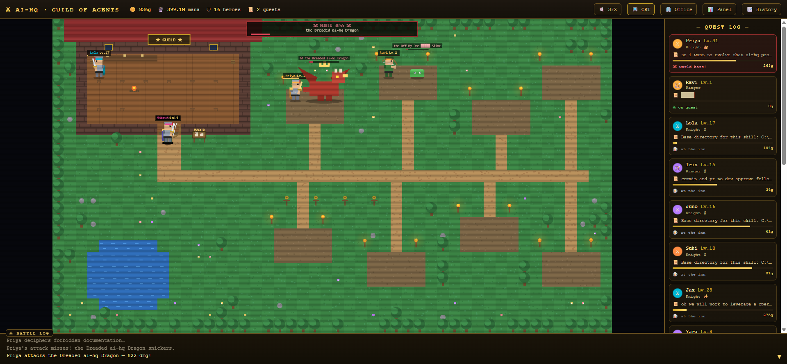
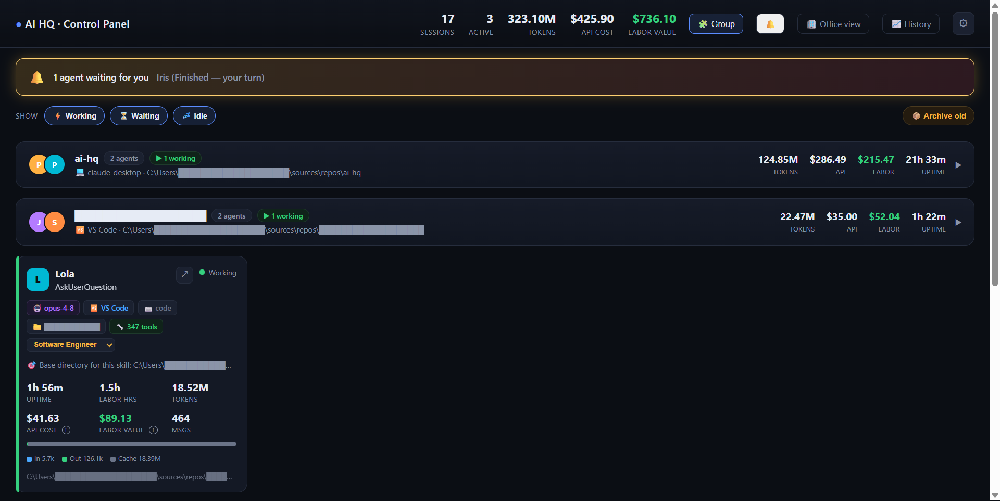
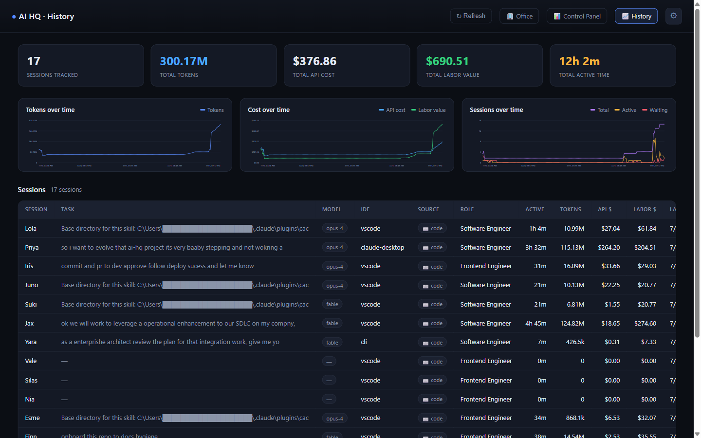

# ⚔️ AgentQuest

**Mission control for your AI agents — as a JRPG.**

Every Claude Code session on your machine becomes a pixel-art **hero** in a living guild world: their task is a **quest**, working means **battling a monster** sized by the job, tool calls land as **attacks in a live battle log**, and the biggest project spawns a **☠ WORLD BOSS**. Behind the game sits a full **control panel** with cost & labor analytics, response-time tracking, durable history, and native notifications.

Zero build. Zero frameworks. One `npm start`.



---

## Why

If you run many AI agents in parallel, you have two problems:

1. **Awareness** — who's working, who's stuck, who's waiting on *you*, and what is all of it costing?
2. **Caring** — dashboards are boring, so you stop looking at them.

AgentQuest solves both: it's a real operations panel (cost, labor value, alerts, history, response-time analytics) wearing a 16-bit JRPG that makes you actually *want* to watch your agents work.

## ✨ Features

| | |
| --- | --- |
| ⚔️ **Quest world** (`/`) | Heroes with classes (from inferred roles), levels & XP (from tokens), visible **gear progression** (cape → golden arms → crown + aura), **party formations** for same-project agents, monsters tiered slime → goblin → golem → dragon, a **world boss** with its own HP banner, victory fanfares & coin showers, comedy misses, tavern gossip, and an opt-in **chiptune SFX** engine |
| 📜 **Hero sheets** | Click any hero (on the map or quest log) for their full status screen: current quest & live activity, the agent's **actual last message**, career stats (gold/mana/cost/uptime), **real tool usage as skill bars**, and their response-time record — plus focus-window and open-folder actions |
| 📊 **Control panel** (`/#panel`) | Per-session cards: model, IDE, token breakdown, API cost, labor value, live activity. **Workspace grouping** into team cards, status filters, one-click **Archive old** |
| 💬 **Question preview** | Waiting cards show what the agent is actually asking (transcript-extracted) with a live *waiting for Xm* timer |
| 🔔 **Notifications** | Server-fired native **Windows toasts** + optional phone push (**ntfy.sh** / Telegram / webhook) — no browser needed — with a one-time reminder nag |
| ⏱ **Response analytics** | Every wait→response cycle logged: median response time, wait-time buckets, ignored-alert counts — your real parallelism ceiling, measured |
| 📈 **History** (`/#history`) | Lifetime tiles, trend charts (tokens / cost / sessions), and a durable per-session archive that survives clearing the board |
| 💰 **Cost & labor accounting** | API cost estimated from transcripts; each agent gets a role → salary → hourly rate → **labor value** of its active work |
| 🤝 **Two ingestion paths** | Claude Code via hooks, plus Claude Desktop **cowork** sessions via a log watcher (badged `code` / `cowork`) |
| 📱 **Installable (PWA)** | Manifest + service worker + icons: install it as a standalone desktop app window |

### Control panel & history




---

## 🚀 Quick start

Requirements: **Node 18+**, and [Claude Code](https://claude.com/claude-code) (any surface: CLI, VS Code, Claude Desktop).

```bash
git clone https://github.com/Kapala-Solutions/agentquest.git
cd agentquest
npm install
npm run setup     # wires the Claude Code hooks into ~/.claude/settings.json (backup + merge, idempotent)
npm start
```

Open **http://localhost:3456**, restart your Claude Code sessions, and watch your agents walk into the guild.

That's it. `npm run setup` merges seven hook entries (SessionStart, UserPromptSubmit, PreToolUse, PostToolUse, Stop, Notification, SessionEnd) into your `~/.claude/settings.json` — it backs the file up first, keeps your existing hooks, and can be re-run safely. Prefer to see it first? `npm run setup -- --dry`.

<details>
<summary>Manual hook setup (if you'd rather paste JSON yourself)</summary>

Each hook runs `send-event.ps1`, which reads the hook payload from stdin and POSTs it to the server. Add to `~/.claude/settings.json`, replacing `<PATH>` with this repo's absolute path:

```jsonc
{
  "hooks": {
    "SessionStart":     [{ "hooks": [{ "type": "command", "command": "powershell -NoProfile -ExecutionPolicy Bypass -Command \"& '<PATH>/send-event.ps1' -Type SessionStart -Server 'http://127.0.0.1:3456'\"" }] }],
    "UserPromptSubmit": [{ "hooks": [{ "type": "command", "command": "powershell -NoProfile -ExecutionPolicy Bypass -Command \"& '<PATH>/send-event.ps1' -Type UserPromptSubmit -Server 'http://127.0.0.1:3456'\"" }] }],
    "PreToolUse":       [{ "matcher": ".*", "hooks": [{ "type": "command", "command": "powershell -NoProfile -ExecutionPolicy Bypass -Command \"& '<PATH>/send-event.ps1' -Type PreToolUse -Server 'http://127.0.0.1:3456'\"" }] }],
    "PostToolUse":      [{ "matcher": ".*", "hooks": [{ "type": "command", "command": "powershell -NoProfile -ExecutionPolicy Bypass -Command \"& '<PATH>/send-event.ps1' -Type PostToolUse -Server 'http://127.0.0.1:3456'\"" }] }],
    "Stop":             [{ "hooks": [{ "type": "command", "command": "powershell -NoProfile -ExecutionPolicy Bypass -Command \"& '<PATH>/send-event.ps1' -Type Stop -Server 'http://127.0.0.1:3456'\"" }] }],
    "Notification":     [{ "hooks": [{ "type": "command", "command": "powershell -NoProfile -ExecutionPolicy Bypass -Command \"& '<PATH>/send-event.ps1' -Type Notification -Server 'http://127.0.0.1:3456'\"" }] }],
    "SessionEnd":       [{ "hooks": [{ "type": "command", "command": "powershell -NoProfile -ExecutionPolicy Bypass -Command \"& '<PATH>/send-event.ps1' -Type SessionEnd -Server 'http://127.0.0.1:3456'\"" }] }]
  }
}
```
</details>

### Optional extras

- **Start with Windows** — flip the toggle in ⚙ Settings (or run `install-autostart.ps1`); the server launches hidden on login.
- **Install as an app** — ⚙ Settings → *Install as app* for a dedicated desktop window.
- **Phone push** — install the free [ntfy](https://ntfy.sh) app, subscribe to a secret topic, paste it in ⚙ Settings, hit *Test*.

---

## 🗺 The views

| URL | View |
| --- | --- |
| `/` | **Quest world** — the JRPG (default). `/#panel` and `/#history` deep-link the other tabs; all three stay mounted, so switching is instant |
| `/dashboard` | Control panel (standalone) |
| `/history` | History & response analytics (standalone) |
| `/rpg` | Quest world (standalone) |

`/?agent=<sessionId>` jumps straight to that hero and opens their sheet.

## 🧠 How it works

```
Claude Code hooks ─┐
(send-event.ps1)   ├──▶  server.js (:3456)  ──▶  WebSocket  ──▶  quest world · panel · history
Claude Desktop     │        · session store & personas
main.log watcher ──┘        · transcript parsing (tokens, cost, model, last message)
(desktop-watcher.js)        · roles → labor value  · response-time log
                            · history.csv · sessions-history.jsonl · responses.jsonl
                            · native toasts (notify.ps1) + ntfy/Telegram/webhook push
```

Plain Node, no build step, one dependency (`ws`). All state is human-readable files next to the server.

## ⚙️ Configuration — `config.json`

```jsonc
{
  "port": 3456,
  "staleMinutes": 15,      // mark a quiet session "idle" after N minutes
  "abandonMinutes": 45,    // drop a stuck "needs you" alert after N minutes
  "watchDesktop": true,    // Claude Desktop cowork log watcher
  "notify": {
    "toast": true,          // native Windows toasts
    "stops": true,          // also alert on turn-end ("your turn"), not just input requests
    "remindMinutes": 10,    // nag once if still waiting after N minutes (0 = off)
    "ntfyTopic": "",        // phone push via ntfy.sh
    "telegramToken": "",    // …or a Telegram bot
    "telegramChatId": "",
    "webhookUrl": ""        // …or any JSON webhook {app, title, body}
  }
}
```

> ⚠️ Treat push credentials as secrets: anyone who knows an ntfy topic can read it. Use a long random topic name, and don't commit a private `config.json` to a public fork.

## 🔌 HTTP API

| Method | Route | Purpose |
| --- | --- | --- |
| `GET` | `/sessions` | All sessions (JSON) |
| `GET` | `/history.csv` | Aggregate time-series |
| `GET` | `/history/sessions` | Per-session archive + live sessions (merged) |
| `GET` | `/responses` | Wait→response log |
| `GET`/`POST` | `/notify-config` · `POST /notify-test` | Notification settings / test |
| `GET`/`POST` | `/autostart` | Read / toggle "Start with Windows" |
| `POST` | `/event` | Hook event ingestion |
| `POST` | `/focus` · `/open-folder` | Focus a session's window / open its folder |
| `POST` | `/rename` · `/role` · `/clear` | Rename, set role, archive sessions |

## 🖥 Platform notes

- **Windows**: everything works — event capture, window focus, native toasts, autostart.
- **macOS / Linux**: the server and all views run fine; event capture works if [PowerShell 7 (`pwsh`)](https://github.com/PowerShell/PowerShell) is installed (`npm run setup` uses it automatically). Window-focus, toasts, and autostart are Windows-only today — phone push (ntfy/Telegram/webhook) works everywhere. PRs welcome.

## 🤝 Contributing

Issues and PRs are very welcome. The codebase is deliberately simple: one Node server (`server.js`), standalone HTML views (`rpg.html`, `dashboard.html`, `history.html`, `app.html` shell), and pure-canvas procedural pixel art — no build pipeline to fight. Fun starter ideas: more monster types, hero pets, weather, quest scoreboards, macOS focus/notification support.

## 📜 License & credits

[MIT](LICENSE) © Kapala Solutions.

Lineage: started as a fork of [jaysonbrush/ai-hq](https://github.com/jaysonbrush/ai-hq) (a pixel-office toy inspired by [PixelHQ](https://www.reddit.com/r/ClaudeCode/comments/1qrbsfa/)); since rebuilt from the ground up into the product you see here.
